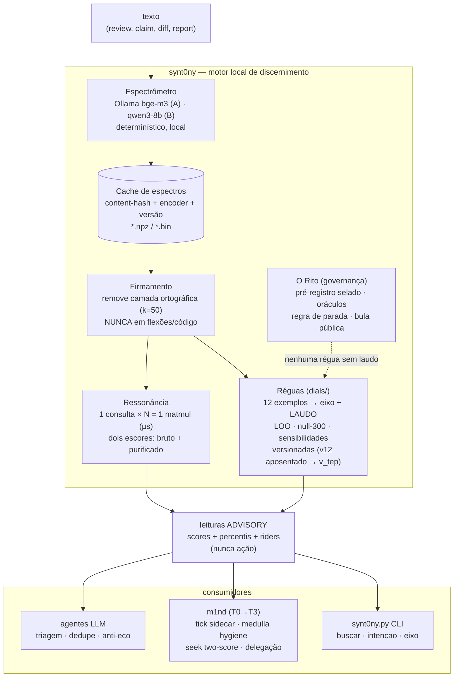
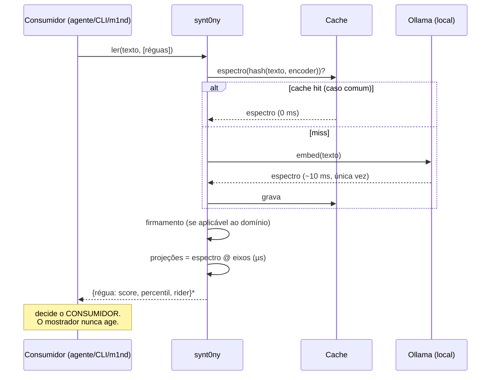
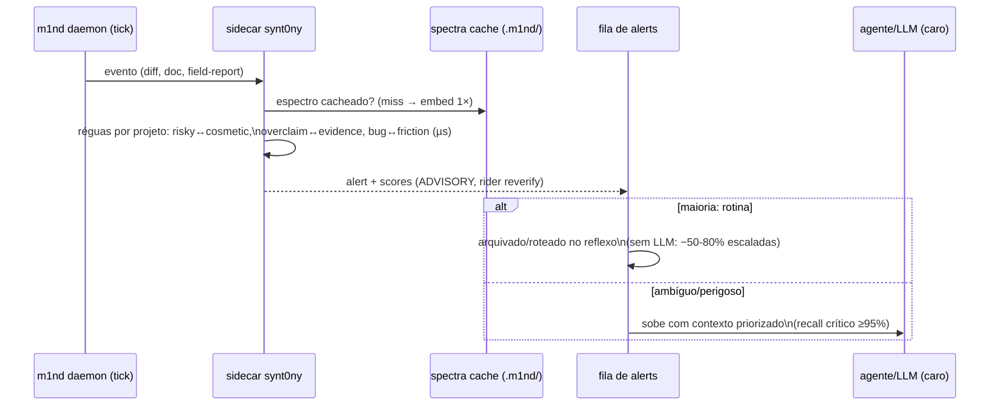
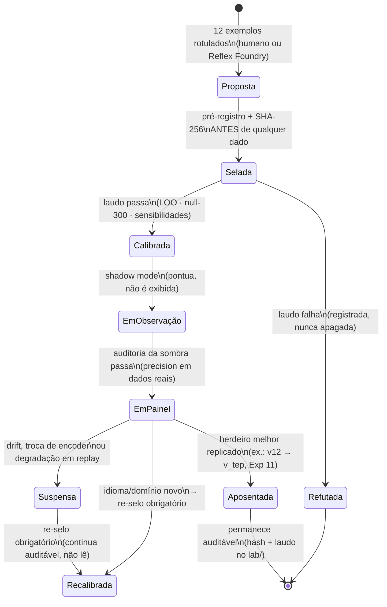

# UML — synt0ny e subsistemas
2026-07-11 · Autoria: assento Fable · Par do docs/PRD.md. Diagramas em
mermaid (renderizam no GitHub). Fonte de verdade do estado: PATHOS.md.

## 1. Componentes — o motor e a fronteira m1nd

## 2. Sequência — leitura de um texto (o caminho quente)

## 3. Sequência — Tick Spectrometer no daemon do m1nd (T0)

## 4. Estados — ciclo de vida de uma régua

## 5. Notas de fronteira (amarras aos fatos)
- O seam do m1nd é real: trait `Embedder` em `m1nd-core/src/embed.rs:39`,
  cache com invalidação por `model_id+dim` em `embed_cache.rs` — o comentário
  do próprio arquivo pede o tier transformer que o espectrômetro fornece.
- Pontos de entrada T0-T3 com arquivo:linha: docs/FRONTEIRA-M1ND.md.
- Todo diagrama acima descreve comportamento MEDIDO ou selado em pré-registro;
  o que é meta futura está marcado com os tiers do roadmap (PRD §8).
